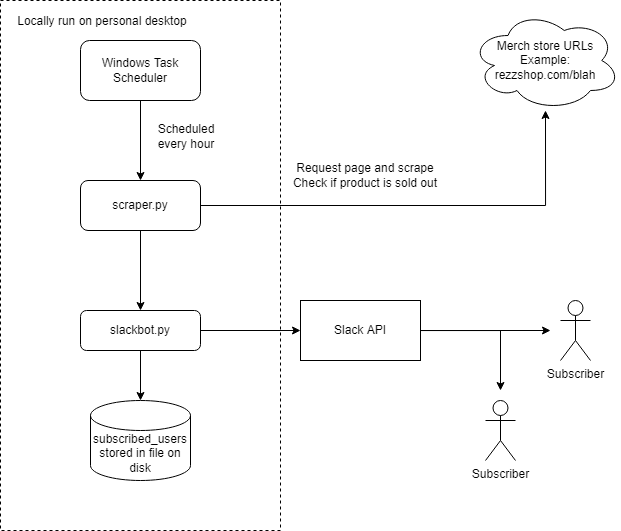

# What is this?

This is a simple asynchronous webpage scraper task, run through Windows Task Scheduler in configurable intervals, that checks the availability of products and notifies a list of subscribers through the Slack API when products are no longer sold out. Best of all, this system is entirely FREE and works entirely through local hardware and free APIs.

## Example

python3 scraper.py -u https://rezzshop.com/collections/apparel/products/pre-order-rezz-v2-baseball-jersey https://rezzshop.com/collections/apparel/products/rezz-queen-space-mom-baseball-jersey https://rezzshop.com/collections/apparel/products/rezz-as-above-black-crewneck-sweatshirt

